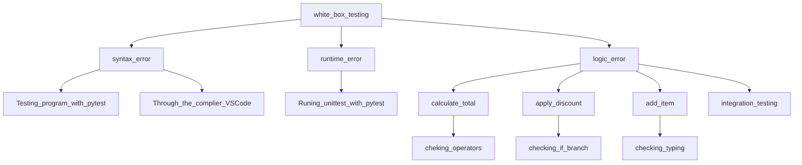

# TestingBuggyCode, Markdown plugin(Markdown Preview Mermaid Support)

```mermaid
graph TD;
    white_box_testing --> syntax_error;
    white_box_testing --> runtime_error;
    white_box_testing --> logic_error;

    syntax_error --> Testing_program_with_pytest;
    syntax_error --> Through_the_complier_VSCode;

    runtime_error --> Runing_unittest_with_pytest;

    logic_error --> calculate_total;
    logic_error --> apply_discount;
    logic_error --> add_item;
    logic_error --> integration_testing;

    calculate_total --> cheking_operators;
    apply_discount --> checking_if_branch;
    add_item --> checking_typing;
```